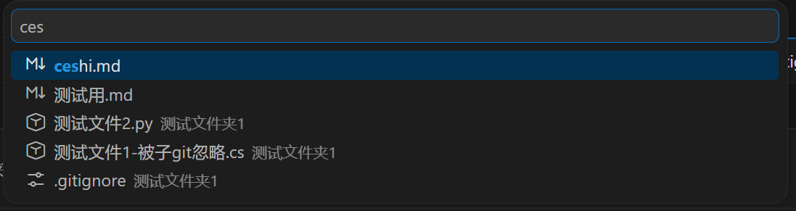
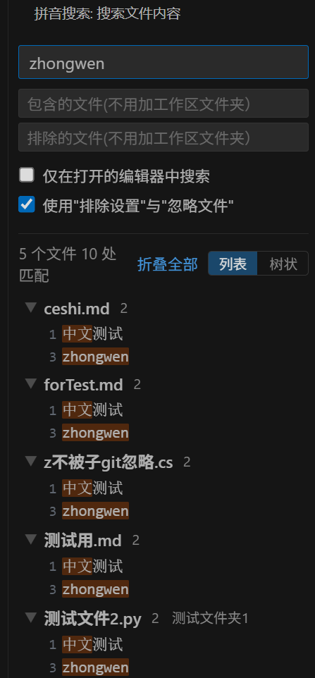

# PinyinSousuo（拼音搜索）

VS Code 插件，支持用拼音匹配文件名和文件内容。

## 功能
### 拼音搜索文件

打开文件选择面板，可输入 拼音 搜索文件，并快速打开

- 快捷键：`Alt+P` ； 
- 命令: pinyinsousuo.searchFiles  拼音搜索：搜索文件
- 输入拼音（全拼或首字母）、中文、英文，匹配工作区内的文件名和路径
- 
### 拼音搜索文件内容
可在侧边栏拼音搜索文件内容 

- 快捷键：`Shift+Y`（聚焦搜索框，同时带入选中的文本）
- 命令: pinyinsousuo.focusSearch  拼音搜索：搜索文件内容
- 侧边栏 Webview 视图，在每个匹配行内高亮匹配区间
- 输入拼音（全拼或首字母）、中文、英文进行搜索
- 点击结果行直接在编辑器中打开并定位

#### 过滤选项

| 选项 | 说明 |
|------|------|
| 包含的文件 | Glob 模式限定搜索范围，支持多组（逗号/分号/换行分隔） |
| 排除的文件 | Glob 模式排除匹配文件，支持多组（逗号/分号/换行分隔） |
| 仅在打开的编辑器中搜索 | 限定搜索范围为已打开标签页 |
| 使用"排除设置"与"忽略文件" | 启用后自动应用 `search.exclude`、`files.exclude` 及 `.gitignore` |

#### 模式规范化

用户输入的包含/排除模式自动适配 `findFiles` API，对齐 VS Code 原生搜索行为：

- 去掉 `./` 前缀
- 连续星号修正：`***.md`、`**.md` → `**/*.md`
- 无 glob 字符 + 无后缀 → 视为目录，追加 `/**`
- 无 glob 字符 + 有后缀 → 视为文件名，追加 `**/` 前缀
- 多根工作区：`./工作区名称/子路径` 识别为 `RelativePattern`，限定在该工作区内

## 依赖

- [pinyin-match](https://www.npmjs.com/package/pinyin-match) — 拼音匹配引擎
